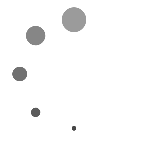
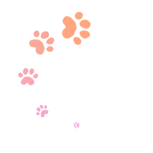

# Loading Animation Generator

## Overview
This is a web tool for generating loading animations. You can customize the number, size, color, and motion of the elements to create your own unique animation. It supports both simple circles and user-uploaded PNG images as animation elements. The created animations can be exported as a sequence of PNG images (in a ZIP file) or as an APNG file.

## 概要
これはローディングアニメーションを生成するためのWebツールです。要素の数、大きさ、色、動きをカスタマイズして、独自のアニメーションを作成できます。アニメーションの要素として、シンプルな円とユーザーがアップロードしたPNG画像の両方をサポートしています。作成したアニメーションは、連番のPNG画像（ZIPファイル形式）またはAPNGファイルとしてエクスポートできます。

## Recommended Environment
This tool is designed for use on a PC with the Google Chrome browser. Operation on other devices or browsers is not guaranteed.

## 推奨環境
このツールは、PC上のGoogle Chromeブラウザでの使用を想定しています。他のデバイスやブラウザでの動作は保証されていません。

## Demo
You can try this tool on the page below.

https://black-sesame-ice-cream.github.io/Loading-Animation-Generator/

## デモ
以下のページでこのツールを試すことができます。

https://black-sesame-ice-cream.github.io/Loading-Animation-Generator/

## Controls
### General Settings
- **Number of Elements**: Adjusts the total number of circles or images in the animation.
- **Gradient Length**: Sets the number of elements over which the gradient (from the start element to the end element) is applied.
- **Container Size (px)**: Changes the width and height of the animation canvas.
- **Margin (%)**: Defines the empty space from the edge of the container to the animation's orbit.
- **Global Rotation (deg)**: Rotates the entire animation around its center.
- **Loop Time (ms)**: Sets the duration for one full animation cycle, in milliseconds.

### Start Element / End Element
- **Tint Color (RGB)**: Sets the tint color of the element.
- **Tint Alpha**: Controls the intensity of the tint color. At 1.0, the element is fully tinted; at 0.0, the original image color is visible.
- **Opacity**: Controls the overall transparency of the element.
- **Size (%)**: Determines the size of the element.

### Image Settings
- **Upload Custom Image...**: Opens a file dialog to upload a PNG image.
- **Use Default Circle**: Reverts to using the default circle element. This option is only visible when a custom image has been uploaded.
- **Current**: Displays the filename of the uploaded image.
- **Image Orientation**:
    - **fixed**: All images maintain the same orientation.
    - **center**: Each image rotates to face the center of the animation.

### Outline Settings
- **Enable Outline**: Adds an outline to each element.
- **Color (RGB)**: Sets the color of the outline.
- **Width (%)**: Sets the width of the outline relative to the container size.

### Export
- **Save as PNG (ZIP)**: Exports the animation as a sequence of individual PNG frames, packaged in a ZIP file.
- **Save as APNG**: Exports the animation as a single Animated PNG (APNG) file.

## 各種設定

### 一般設定 (General Settings)
- **Number of Elements (要素の数)**: アニメーションに含まれる円または画像の総数を設定します。
- **Gradient Length (グラデーションの長さ)**: 開始要素から終了要素へのグラデーションが適用される要素の数を設定します。
- **Container Size (px) (全体の大きさ)**: アニメーションのキャンバスの幅および高さを設定します。
- **Margin (%) (余白)**: キャンバスの端からアニメーションの軌道までの空白スペースを設定します。
- **Global Rotation (deg) (全体回転)**: アニメーション全体をその中心を軸に回転させます。
- **Loop Time (ms) (1ループの時間)**: アニメーションの1サイクルにかかる時間をミリ秒単位で設定します。

### 開始要素 / 終了要素 (Start Element / End Element)
- **Tint Color (RGB) (ティントカラー)**: 要素の着色（ティント）の色を設定します。
- **Tint Alpha (ティントのアルファ)**: ティントカラーの適用度を制御します。1.0で完全に着色され、0.0で元の画像の色が見えます。
- **Opacity (透明度)**: 要素全体の透明度を設定します。
- **Size (%) (大きさ)**: 要素の大きさを設定します。

### 画像設定 (Image Settings)
- **Upload Custom Image... (カスタム画像をアップロード...)**: PNG画像をアップロードするためのファイルダイアログを開きます。
- **Use Default Circle (デフォルトの円を使用)**: デフォルトの円要素の使用に戻します。このオプションはカスタム画像がアップロードされている場合にのみ表示されます。
- **Current (現在)**: アップロードされた画像のファイル名を表示します。
- **Image Orientation (画像の向き)**:
    - **fixed (固定)**: すべての画像が同じ向きを維持します。
    - **center (中心を向く)**: 各画像がアニメーションの中心を向くように回転します。

### アウトライン設定 (Outline Settings)
- **Enable Outline (アウトラインを有効化)**: 各要素にアウトライン（縁取り）を追加します。
- **Color (RGB) (色)**: アウトラインの色を設定します。
- **Width (%) (幅)**: 全体の大きさに対するアウトラインの幅を設定します。

### エクスポート (Export)
- **Save as PNG (ZIP)**: アニメーションを個別のPNGフレームのシーケンスとして、ZIPファイルにパッケージ化してエクスポートします。
- **Save as APNG**: アニメーションを単一のアニメーションPNG（APNG）ファイルとしてエクスポートします。

## Tech Stack
- HTML
- CSS
- JavaScript
- lil-gui (for the control panel)
- JSZip (for creating ZIP files)
- UPNG.js (for creating APNG files)